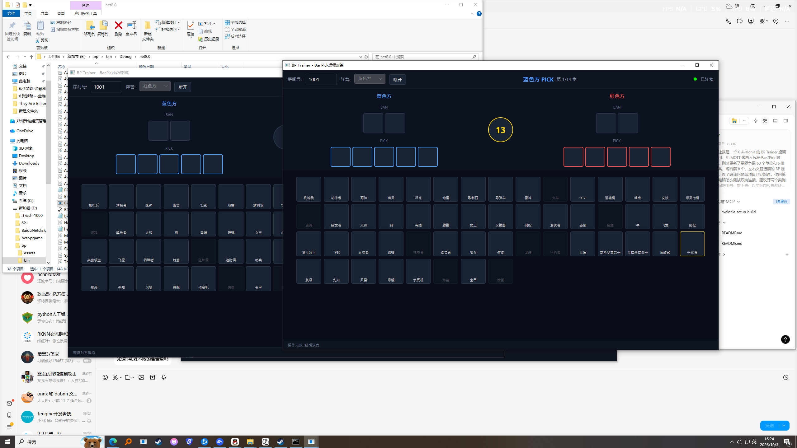

# BP Trainer - 星际争霸 Ban/Pick 远程对练工具

一款为《星际争霸》玩家设计的 BP（Ban/Pick）远程训练软件。两个玩家可以在各自的电脑上通过公网 MQTT broker 联机，练习开局的禁用与选择策略，无需在同一局域网内。

## 特性

- **跨网络连接**：仅需一方能访问公网 MQTT broker（默认 `broker.hivemq.com:1883`），双方可在 CGNAT、家宽、校园网等不同网络环境下对练
- **房间号匹配**：4 位数字房间号，双方输入相同房间号即可加入同一对局
- **双方就绪机制**：只有当两个玩家都进入房间后计时器才会启动，避免单人空等
- **单位独立选择**：双方各自选兵，互不冲突。己方 ban 的单位仅限制对方，自己仍可选用
- **系统随机禁用**：开局随机禁用 8 个单位，双方基于相同房间号得到相同结果
- **14 步 BP 流程**：Pick→Pick→Pick→Pick→Ban→Ban→Pick→Pick→Pick→Pick→Ban→Ban→Pick→Pick
- **双计时器**：每步 45 秒操作时间 + 45 秒备用时间池。主时间耗尽后自动切换到备用时间（橙色边框），备用耗尽则超时自动随机选择
- **复盘回放**：对局结束后可打开复盘窗口，支持上一步/下一步/播放/暂停，可调节播放速度
- **对局导出**：一键将完整 BP 流程导出为 JSON，方便复盘或分享

## 界面预览



主界面布局：
- **顶部栏**：房间号输入、阵营选择、连接按钮、当前回合指示、计时器、连接状态
- **左侧面板**：蓝色方的 Ban/Pick 槽位
- **中间区域**：53 个《星际争霸》单位，按 6 行分类排列（人族地面/空中、虫族地面/空中、神族地面/空中）
- **右侧面板**：红色方的 Ban/Pick 槽位
- **底部状态栏**：显示当前操作提示

## 快速开始

### 下载预编译版本

从 [Releases](../../releases) 页面下载最新版，解压后双击 `BPTrainer.exe` 即可运行（无需安装 .NET 运行时）。

### 从源码构建

要求：
- .NET SDK 8.0+
- Windows / macOS / Linux

```bash
git clone https://github.com/yourname/bp-trainer.git
cd bp-trainer
dotnet build -c Release
dotnet run
```

### 发布单文件版本

```bash
dotnet publish -c Release -r win-x64 --self-contained true \
  -p:PublishSingleFile=true \
  -p:IncludeNativeLibrariesForSelfExtract=true
```

生成的可执行文件位于 `bin/Release/net8.0/win-x64/publish/`，与 `heroes.json` 一同分发即可。

## 使用方法

1. 你和对手分别在自己的电脑上打开 BP Trainer
2. 双方输入相同的 4 位房间号（例如 `1234`）
3. 双方各自选择阵营（一个蓝色方，一个红色方）
4. 点击"加入房间"，等待对方连接
5. 双方都进入后，系统会随机禁用 8 个单位，然后开始 BP
6. 按当前回合提示选择要 ban/pick 的单位，倒计时结束会自动随机选择
7. 14 步全部完成后，点击"复盘"回放整局，或点击"导出"保存 JSON 记录

## 技术栈

| 组件 | 用途 |
|------|------|
| C# / .NET 8 | 主语言与运行时 |
| [Avalonia UI 11.1](https://avaloniaui.net/) | 跨平台桌面 UI 框架 |
| [MQTTnet 4.3](https://github.com/dotnet/MQTTnet) | MQTT 客户端 |
| System.Text.Json | 消息序列化 |

## 通信协议

所有消息通过 MQTT 主题 `bp/training/room_{roomId}` 广播。消息类型：

```json
{ "type": "action",          "senderId": "abc123", "action":  { "side": 0, "type": 0, "heroId": "marine" } }
{ "type": "join",             "senderId": "abc123", "side": 0 }
{ "type": "snapshot_request", "senderId": "abc123" }
{ "type": "snapshot",         "senderId": "abc123", "snapshot": { ... } }
```

**防回环**：每条消息都带 `senderId`（客户端连接时生成的 GUID），接收方会过滤掉自己发出的消息。

**状态同步**：操作方本地立即应用动作并通过 MQTT 发送给对方，双方状态保持一致。晚加入的客户端通过 `snapshot_request/snapshot` 拉取当前对局状态。

## BP 配置

所有 BP 参数集中在 `BpState.cs` 的 `BpConfig` 类中：

```csharp
public class BpConfig
{
    public int BlueBanCount { get; set; } = 2;      // 蓝方 Ban 数
    public int RedBanCount { get; set; } = 2;       // 红方 Ban 数
    public int BluePickCount { get; set; } = 5;     // 蓝方 Pick 数
    public int RedPickCount { get; set; } = 5;      // 红方 Pick 数
    public int SystemBanCount { get; set; } = 8;    // 系统随机 Ban 数
    public int ActionTimerSeconds { get; set; } = 45;  // 单步操作时间
    public int BackupTimerSeconds { get; set; } = 45;   // 备用时间池
    // ActionSequence / SideSequence 定义 14 步顺序
}
```

## 单位列表

编辑 `heroes.json` 可以自定义单位。每项字段：

```json
{
  "heroId": "marine",
  "heroName": "机枪兵",
  "imagePath": "assets/marine.png",
  "row": 1
}
```

`row` 决定单位显示在第几行（当前 6 行对应种族 + 地面/空中分类）。图片文件放入 `assets/` 目录，缺失时会自动回退显示单位名称。

## 已知限制

- 依赖公共 MQTT broker，消息延迟视网络情况而定（一般 < 500ms）
- 双方必须选择不同阵营，暂无强制校验
- 断线重连期间对方仍可继续操作，但重连方可能看到短暂状态不同步

## License

MIT
